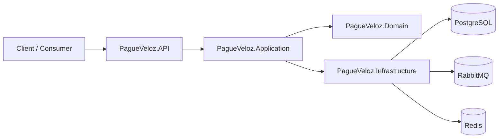
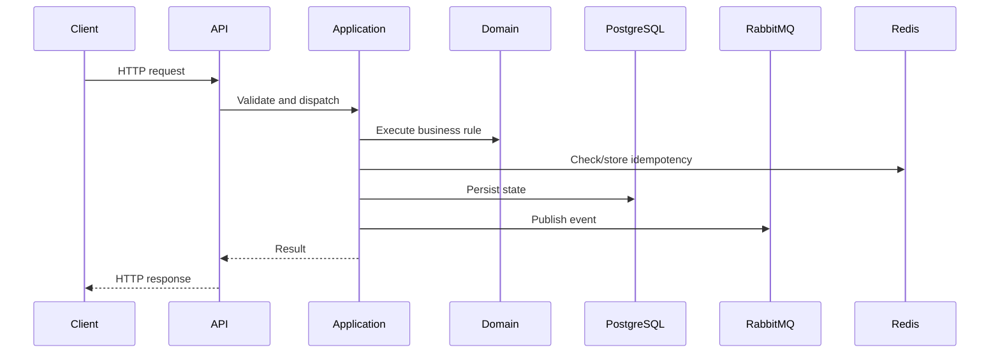

# pagueveloz

## Overview

PagueVeloz is a compact financial transaction service built with Clean Architecture and DDD principles. Domain logic is explicit, business invariants are protected, and the system remains straightforward under load and failure.

The codebase prioritizes correctness. Transactional paths are simple, runtime dependencies are minimal, and unnecessary ceremony is avoided.

## Scope

This repository handles:

- Account creation
- Balance-affecting transactions
- Idempotent processing
- Integration event publication
- Caching and resilience

It does **not** try to be a distributed ledger, event-sourced platform, analytics system, CQRS demo, or over-decomposed microservices architecture. These choices were deliberate. The current product scope does not justify the infrastructure overhead.

## Architecture

Layered boundaries:

- **Domain**: Business rules and invariants.
- **Application**: Use case orchestration and dependencies.
- **Infrastructure**: Persistence, messaging, caching, external integration.
- **API**: HTTP composition root.

Framework concerns stay out of business logic. Core behavior is testable without the full stack.

### High-Level Architecture



### Request Flow



Request paths are kept short. Validation and orchestration happen early, the domain decides, and infrastructure commits before responding.

## Design Decisions

### No CQRS

CQRS adds separate models and scaling paths. This system is small, write-centric, and correctness-sensitive. Separate command/query models would add mapping, duplication, and failure points without solving a real bottleneck. Not justified here.

### Strong Consistency

PostgreSQL is the source of truth. The system rejects requests or delays completion rather than confirm results that could be contradicted later. A temporary availability loss is acceptable; balance drift is not.

### CAP Trade-off

The system prioritizes consistency over availability for writes. If a dependency fails or the network is impaired, the service fails safely rather than inventing outcomes. Constraints:

- Better correctness under failure
- Reduced tolerance for infrastructure partitions
- Lower theoretical availability for safer financial behavior

### System Trade-offs

- PostgreSQL is the single record system (simplifies correctness, limits horizontal write scaling)
- RabbitMQ carries events (not authoritative)
- Redis supports caching and idempotency (not durable business storage)
- No event sourcing or separate analytical read models
- API prioritizes straightforward behavior

These are deliberate choices, not limitations.

## Repository Structure

- `PagueVeloz.Domain`: Entities, value objects, business rules
- `PagueVeloz.Application`: Use cases, orchestration, abstractions
- `PagueVeloz.Infrastructure`: Persistence, messaging, caching, adapters
- `PagueVeloz.API`: HTTP endpoints, OpenAPI, composition root
- `PagueVeloz.Tests`: Unit and integration tests

## Runtime Dependencies

- PostgreSQL: Durable transactional state
- RabbitMQ: Asynchronous event publication
- Redis: Caching and idempotency support

Docker Compose wires these together for end-to-end local testing.

## Running the Service

### Start Everything

```bash
docker compose pull
docker compose up -d
```

Local services:

- HAProxy (load-balanced API): <http://localhost:9999>
- Swagger UI: <http://localhost:9999/swagger/index.html>
- OpenAPI: <http://localhost:9999/openapi/v1.json>
- PostgreSQL: localhost:5432
- Redis: localhost:6379
- RabbitMQ: localhost:5672 (Management: <http://localhost:15672>)

### Stop Everything

```bash
docker compose down
```

### Run API Locally

```bash
dotnet run --project PagueVeloz.API
```

## Configuration

Required settings when using PostgreSQL and RabbitMQ:

- `ConnectionStrings:PagueVeloz`
- `Messaging:RabbitMq:Host`
- `Messaging:RabbitMq:Port`
- `Messaging:RabbitMq:Username`
- `Messaging:RabbitMq:Password`
- `Cache:Redis:ConnectionString`

Without these, the infrastructure falls back to in-memory or degraded implementations.

## Testing

Follow this exact sequence to reproduce the evaluation runs used by the project maintainers. The test scripts rely on `./scripts/docker-helpers.sh` which performs common repairs and creates a marker file; run it first and do not expect other scripts to invoke it automatically.

1) Prepare Docker services and automatic repair (must run first)

```bash
./scripts/docker-helpers.sh --build
```

2) Unit tests (fast, no external services)

```bash
dotnet test PagueVeloz.sln --filter "Category!=Integration" -v minimal
```

3) Integration tests (requires `docker-helpers` marker)

```bash
WAIT_TIMEOUT=180 ./scripts/run-integration-tests.sh
```

4) End-to-end tests (full stack; requires `docker-helpers --build`)

```bash
WAIT_TIMEOUT=180 ./scripts/run-e2e-tests.sh
```

5) Load tests (k6)

```bash
./scripts/docker-helpers.sh --build
k6 run load-tests/k6/loadtest.js
```

Notes:

- `./scripts/docker-helpers.sh` creates a marker file `.docker_helpers_done`. Integration and E2E scripts require that marker and will fail if it's missing.
- The helper attempts automatic repair for common RabbitMQ `.erlang.cookie` issues and recreates volumes when needed.

## Failure Handling

### Fallback Infrastructure

- PostgreSQL unavailable → in-memory account and idempotency stores
- RabbitMQ unavailable → in-memory event storage
- Application can start locally without full stack (durability guarantees are weaker)

### Concurrency Control

Per-account locks prevent interleaved writes during concurrent requests. Balance checks and mutations remain consistent. Lock acquisition respects cancellation tokens for clean shutdown.

### Message Publishing Resilience

RabbitMQ connections are lazy, use exponential backoff, and are wrapped with a circuit breaker. If the broker is unavailable, the API fails the transaction after retries, letting the caller decide retry or error reporting. Prevents cascade failures.

### API Documentation

OpenAPI and Swagger UI are exposed in all environments, including production. Operational teams and debug scripts can always hit `/swagger/index.html` or `/openapi/v1.json` without special setup.

## Development Environment

- OS: Debian GNU/Linux 12 (bookworm)
- Architecture: x86_64
- CPU: 8 vCPUs, Intel Core i5-1135G7 @ 2.40 GHz
- Memory: 7.5 GiB RAM
- .NET SDK: 9.0.314
- Docker: 29.3.0
- Docker Compose: v5.1.0

## Operational Behavior

- PostgreSQL: Authority for transactional state
- RabbitMQ: Event publication and async integration
- Redis: Caching and idempotency support (not durable business storage)
- Consistency boundary unavailable → service fails safely (no optimistic answers)

## API Surface

- `GET /health`
- `POST /api/accounts`
- `POST /api/transactions`

## Horizontal Scalability

This repository includes HAProxy configuration (haproxy.cfg) and two API instances (pagueveloz-app-1 and pagueveloz-app-2) in docker-compose.yml. Uses round-robin distribution and health checking for local development and staging.

### Run Load-Balanced Locally

```bash
docker compose pull
docker compose up -d haproxy pagueveloz-app-1 pagueveloz-app-2 postgres rabbitmq redis
```

### Smoke Test

```bash
curl -v http://localhost:9999/health
```

### Important Notes

- HAProxy setup here is pragmatic testing convenience, not production-grade. Production requires an orchestrator (service discovery, rolling updates, autoscaling, lifecycle management).
- **For production use Kubernetes**: Built-in scaling, health checks, service routing, rolling upgrades, service mesh and observability integration.
- Persistence model is unchanged by API layer horizontalization: PostgreSQL remains single source of truth; transactional semantics don't change.
- For session affinity, path-based routing, or advanced logic, extend HAProxy configuration; don't embed routing in the application.
