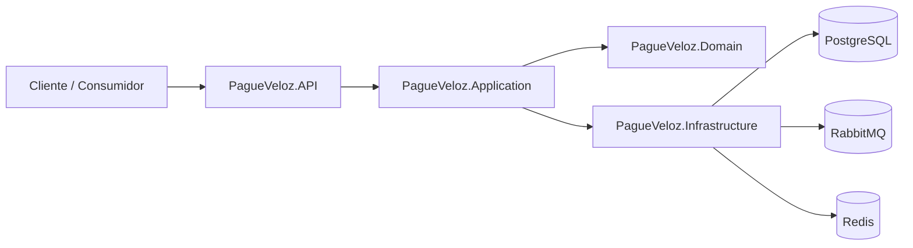
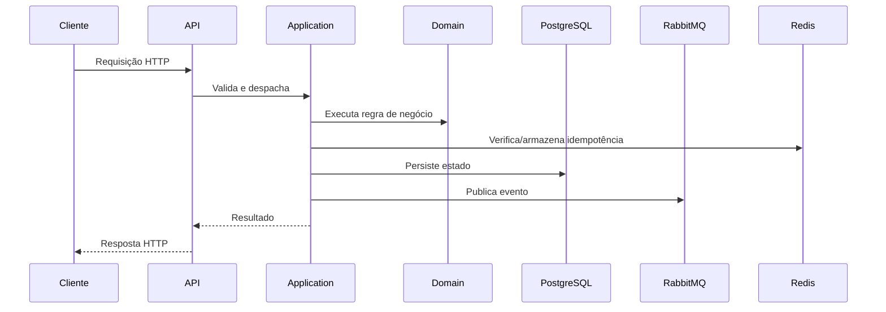

# pagueveloz

## Visão Geral

PagueVeloz é um serviço compacto de transações financeiras construído com Arquitetura Limpa e princípios de DDD. A lógica de domínio é explícita, os invariantes de negócio são protegidos, e o sistema permanece direto sob carga e falha.

O código prioriza correção. Os caminhos transacionais são simples, as dependências de tempo de execução são mínimas, e cerimônia desnecessária é evitada.

## Escopo

Este repositório trata:

- Criação de contas
- Transações que afetam saldo
- Processamento idempotente
- Publicação de eventos de integração
- Cache e resiliência

**Não** tenta ser um registro distribuído, plataforma baseada em event sourcing, sistema analítico, demo de CQRS, ou arquitetura de microsserviços sobre-decomposta. Essas escolhas foram deliberadas. O escopo atual do produto não justifica a sobrecarga de infraestrutura.

## Arquitetura

Limites em camadas:

- **Domínio**: Regras de negócio e invariantes.
- **Aplicação**: Orquestração de casos de uso e dependências.
- **Infraestrutura**: Persistência, mensagens, cache, integração externa.
- **API**: Raiz de composição HTTP.

Preocupações do framework ficam fora da lógica de negócio. O comportamento principal é testável sem toda a pilha.

### Arquitetura de Alto Nível



### Fluxo de Requisição



Caminhos de requisição são mantidos curtos. Validação e orquestração acontecem cedo, o domínio decide, e infraestrutura confirma antes de responder.

## Decisões de Design

### Sem CQRS

CQRS adiciona modelos separados e caminhos de escala. Este sistema é pequeno, orientado para escrita, e sensível à correção. Modelos separados de comando/consulta adicionariam mapeamento, duplicação e pontos de falha sem resolver um gargalo real. Não justificado aqui.

### Consistência Forte

PostgreSQL é a fonte de verdade. O sistema rejeita requisições ou atrasa conclusão em vez de confirmar resultados que poderiam ser contraditos depois. Uma perda temporária de disponibilidade é aceitável; desvio de saldo não é.

### Compensação CAP

O sistema prioriza consistência sobre disponibilidade para escritas. Se uma dependência falha ou a rede está prejudicada, o serviço falha com segurança em vez de inventar resultados. Restrições:

- Melhor correção sob falha
- Tolerância reduzida para partições de infraestrutura
- Menor disponibilidade teórica para comportamento financeiro mais seguro

### Compensações do Sistema

- PostgreSQL é o único sistema de registro (simplifica correção, limita escala horizontal de escrita)
- RabbitMQ carrega eventos (não autoritário)
- Redis suporta cache e idempotência (não armazenamento durável de negócio)
- Sem event sourcing ou modelos de leitura analíticos separados
- API prioriza comportamento direto

Essas são escolhas deliberadas, não limitações.

## Estrutura do Repositório

- `PagueVeloz.Domain`: Entidades, objetos de valor, regras de negócio
- `PagueVeloz.Application`: Casos de uso, orquestração, abstrações
- `PagueVeloz.Infrastructure`: Persistência, mensagens, cache, adaptadores
- `PagueVeloz.API`: Endpoints HTTP, OpenAPI, raiz de composição
- `PagueVeloz.Tests`: Testes unitários e de integração

## Dependências em Tempo de Execução

- PostgreSQL: Estado transacional durável
- RabbitMQ: Publicação de eventos assíncrona
- Redis: Cache e suporte a idempotência

Docker Compose conecta essas dependências para testes end-to-end locais.

## Executando o Serviço

### Inicie Tudo

```bash
docker compose pull
docker compose up -d
```

Serviços locais:

- HAProxy (API com balanceamento de carga): <http://localhost:9999>
- Swagger UI: <http://localhost:9999/swagger/index.html>
- OpenAPI: <http://localhost:9999/openapi/v1.json>
- PostgreSQL: localhost:5432
- Redis: localhost:6379
- RabbitMQ: localhost:5672 (Gerenciamento: <http://localhost:15672>)

### Pare Tudo

```bash
docker compose down
```

### Execute API Localmente

```bash
dotnet run --project PagueVeloz.API
```

## Configuração

Configurações necessárias ao usar PostgreSQL e RabbitMQ:

- `ConnectionStrings:PagueVeloz`
- `Messaging:RabbitMq:Host`
- `Messaging:RabbitMq:Port`
- `Messaging:RabbitMq:Username`
- `Messaging:RabbitMq:Password`
- `Cache:Redis:ConnectionString`

Sem essas, a infraestrutura volta para implementações em memória ou degradadas.

## Testes

Siga esta ordem exata para reproduzir as execuções usadas pelos mantenedores do projeto. Os scripts de teste dependem de `./scripts/docker-helpers.sh`, que realiza reparos comuns e cria um arquivo marcador; execute-o primeiro e não espere que os outros scripts o invoquem automaticamente.

1) Preparar serviços Docker e executar reparos (obrigatório)

```bash
./scripts/docker-helpers.sh --build
```

2) Testes unitários (rápidos, sem serviços externos)

```bash
dotnet test PagueVeloz.sln --filter "Category!=Integration" -v minimal
```

3) Testes de integração (requer marcador do docker-helpers)

```bash
WAIT_TIMEOUT=180 ./scripts/run-integration-tests.sh
```

4) Testes end-to-end (pilha completa; requer docker-helpers --build)

```bash
WAIT_TIMEOUT=180 ./scripts/run-e2e-tests.sh
```

5) Testes de carga (k6)

```bash
./scripts/docker-helpers.sh --build
k6 run load-tests/k6/loadtest.js
```

Observações:

- `./scripts/docker-helpers.sh` cria um arquivo marcador `.docker_helpers_done`. Os scripts de integração e E2E exigem esse marcador e falharão se ele estiver ausente.
- O helper tenta reparos automáticos para problemas comuns com `.erlang.cookie` do RabbitMQ e recria volumes quando necessário.

## Tratamento de Falhas

### Infraestrutura de Fallback

- PostgreSQL indisponível → armazéns em memória de conta e idempotência
- RabbitMQ indisponível → armazenamento de eventos em memória
- Aplicação pode iniciar localmente sem pilha completa (garantias de durabilidade mais fracas)

### Controle de Concorrência

Bloqueios por conta impedem escritas intercaladas durante requisições simultâneas. Verificações de saldo e mutações permanecem consistentes. Aquisição de bloqueio respeita tokens de cancelamento para desligamento limpo.

### Resiliência de Publicação de Mensagens

Conexões RabbitMQ são preguiçosas, usam backoff exponencial e são envolvidas com um disjuntor. Se o broker está indisponível, a API falha a transação após esgotadas as tentativas, deixando o chamador decidir se tenta novamente ou relata erro. Previne falhas em cascata.

### Documentação da API

OpenAPI e Swagger UI são expostos em todos os ambientes, incluindo produção. Equipes operacionais e scripts de depuração sempre podem acessar `/swagger/index.html` ou `/openapi/v1.json` sem setup especial.

## Ambiente de Desenvolvimento

- OS: Debian GNU/Linux 12 (bookworm)
- Arquitetura: x86_64
- CPU: 8 vCPUs, Intel Core i5-1135G7 @ 2.40 GHz
- Memória: 7,5 GiB RAM
- .NET SDK: 9.0.314
- Docker: 29.3.0
- Docker Compose: v5.1.0

## Comportamento Operacional

- PostgreSQL: Autoridade para estado transacional
- RabbitMQ: Publicação de eventos e integração assíncrona
- Redis: Suporte para cache e idempotência (não armazenamento durável de negócio)
- Limite de consistência indisponível → serviço falha com segurança (sem respostas otimistas)

## Superfície da API

- `GET /health`
- `POST /api/accounts`
- `POST /api/transactions`

## Escalabilidade Horizontal

Este repositório inclui configuração HAProxy (haproxy.cfg) e duas instâncias de API (pagueveloz-app-1 e pagueveloz-app-2) em docker-compose.yml. Usa distribuição round-robin e verificação de saúde para desenvolvimento local e staging.

### Execute Com Balanceamento de Carga Localmente

```bash
docker compose pull
docker compose up -d haproxy pagueveloz-app-1 pagueveloz-app-2 postgres rabbitmq redis
```

### Teste Rápido

```bash
curl -v http://localhost:9999/health
```

### Notas Importantes

- Setup HAProxy aqui é conveniência pragmática para testes, não em nível de produção. Produção requer orquestrador (descoberta de serviço, atualizações progressivas, autoescala, gerenciamento de ciclo de vida).
- **Para produção use Kubernetes**: Escala, verificações de saúde, roteamento de serviço, atualizações progressivas, integração com malhas de serviço e observabilidade.
- Modelo de persistência não muda com horizontalização da camada de API: PostgreSQL permanece única fonte de verdade; semântica transacional não muda.
- Para afinidade de sessão, roteamento baseado em caminho ou lógica avançada, estenda configuração HAProxy; não incorpore roteamento na aplicação.
