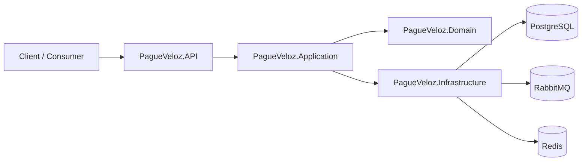
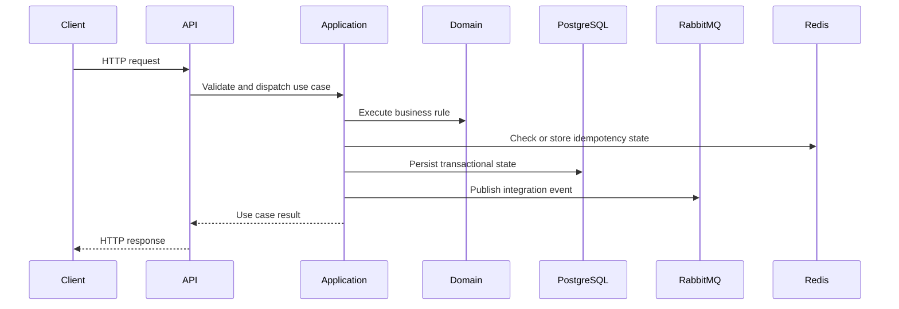

# pagueveloz

## Overview

PagueVeloz is a compact financial transaction service built with Clean Architecture and DDD principles. The intent is simple: keep the domain explicit, protect business invariants, and make the system easy to reason about when it is under load or when something fails.

The codebase is optimized for correctness first. The transactional path stays simple, the runtime dependencies remain small, and the system avoids patterns that would add ceremony without bringing real value at this stage.

## What This Service Is

This repository models a narrow transactional core:

- account creation
- balance-affecting transactions
- idempotent processing
- integration event publication
- operational caching and resilience support

That scope is intentional. It is easier to keep a small financial core correct than to stretch consistency guarantees across too many concerns at once.

## What This Service Is Not

This project is not trying to be:

- a distributed ledger
- an event-sourced financial platform
- a read-heavy analytics system
- a CQRS demo
- a microservices platform with unnecessary decomposition

Those choices were deferred on purpose. The current shape of the product does not justify the extra infrastructure and coordination costs.

## Architecture

The solution follows a layered boundary between domain, use cases, infrastructure, and transport.

- The domain owns the business rules and invariants.
- Application services orchestrate use cases and dependencies.
- Infrastructure provides persistence, messaging, caching, and external integration.
- The API is a thin HTTP composition root.

This separation keeps framework concerns out of the business logic and makes the most important behavior testable without pulling in the whole stack.

### High-Level Architecture



At a high level, the API is only the delivery layer. The application layer coordinates the use case. The domain enforces the rules. Infrastructure persists state, publishes events, and provides supporting capabilities such as caching and idempotency.

### Request Flow



In practice, the request path stays short on purpose. Validation and orchestration happen early, the domain makes the decision, and infrastructure commits the result before the API responds. That keeps the behavior easy to trace and reduces the chance of hidden side effects.

## Why CQRS Was Not Introduced

CQRS is useful when read and write workloads diverge enough to justify separate models and scaling paths. That is not the case here.

The system is small, write-centric, and correctness-sensitive. Introducing separate command and query models would add mapping layers, duplication, and more failure points without solving a real bottleneck. In a larger system, CQRS can be justified. Here, it would be premature complexity.

## Consistency Model

The service prefers strong consistency for the transactional core because it handles money.

PostgreSQL is the source of truth for state that must remain authoritative. The system would rather reject a request or delay completion than confirm a result that could later be contradicted by another actor.

For this domain, that is the safer choice. A temporary availability loss is acceptable if the alternative is balance drift or duplicate state transitions.

## CAP Trade-offs

CAP is not just a slogan here; it is a practical design constraint.

For the core writes, the system favors consistency while remaining partition-aware. If a dependency is unhealthy or a network path is impaired, the service should fail closed instead of inventing a transaction outcome.

In practice, that means:

- better correctness under failure
- reduced tolerance for infrastructure partitions on write paths
- lower theoretical availability in exchange for safer financial behavior

It is a sensible trade-off for a transactional service with a tight scope and a limited delivery window.

## System Trade-offs

The current implementation intentionally prioritizes clarity and operational safety over scale-at-all-costs design.

Key trade-offs:

- PostgreSQL is the single system of record, which simplifies correctness but limits horizontal write scaling.
- RabbitMQ carries integration events, but it is not used as the source of truth.
- Redis is used for caching and idempotency support, not as durable business storage.
- The service does not implement event sourcing or separate analytical read models.
- The API favors straightforward behavior over a heavy abstraction layer.

These are not accidental limitations. They come from choosing the smallest architecture that still supports the guarantees the system needs.

## Domain and Infrastructure Boundaries

The repository keeps business logic away from infrastructure dependencies wherever possible.

That separation makes it easier to:

- test domain behavior without standing up the entire environment
- swap implementations when needed
- keep persistence concerns out of the business model
- reason about transactional correctness

The same principle applies to idempotency, caching, and message publication: each concern exists, but each is isolated behind a narrow boundary.

## Docker Strategy

The runtime image is built with a multi-stage Dockerfile.

Only the published application output reaches the final image. SDK tooling, restore state, source code, and test artifacts are excluded from the runtime layer. That keeps the image smaller, reduces the attack surface, and makes local and CI builds more reproducible.

## Repository Layout

- `PagueVeloz.Domain`: entities, value objects, and business rules.
- `PagueVeloz.Application`: use cases, orchestration, and abstractions.
- `PagueVeloz.Infrastructure`: persistence, messaging, caching, and adapters.
- `PagueVeloz.API`: HTTP endpoints, OpenAPI, and composition root.
- `PagueVeloz.Tests`: unit and integration tests.

## Runtime Dependencies

The application starts with the following infrastructure:

- PostgreSQL for durable transactional state
- RabbitMQ for asynchronous event publication
- Redis for caching and idempotency support

The local compose environment wires those dependencies together so the service can be exercised end-to-end on a single machine.

## Running the Service

### Start Everything with Docker

```bash
docker compose up -d --build
```

Services exposed locally (compose):

- HAProxy (load-balanced API): <http://localhost:9999>
- Swagger UI (via HAProxy): <http://localhost:9999/swagger/index.html>
- OpenAPI document (via HAProxy): <http://localhost:9999/openapi/v1.json>
- PostgreSQL: localhost:5432
- Redis: localhost:6379
- RabbitMQ: localhost:5672
- RabbitMQ Management: <http://localhost:15672>

### Stop Everything

```bash
docker compose down
```

### Run the API Locally

```bash
dotnet run --project PagueVeloz.API
```

## Configuration Notes

The application can run against PostgreSQL and RabbitMQ when the corresponding configuration is present. Without those dependencies, the infrastructure layer falls back to in-memory or degraded implementations where applicable.

Operationally important settings include:

- `ConnectionStrings:PagueVeloz`
- `Messaging:RabbitMq:Host`
- `Messaging:RabbitMq:Port`
- `Messaging:RabbitMq:Username`
- `Messaging:RabbitMq:Password`
- `Cache:Redis:ConnectionString`

## Testing Strategy

The test suite is intentionally split so each layer can be validated at the right cost.

### Unit Tests Only

```bash
dotnet test PagueVeloz.sln --filter "Category!=Integration" -v minimal
```

This runs the fast tests that validate business logic and orchestration without requiring external services.

### Integration Tests Only

```bash
chmod +x scripts/run-integration-tests.sh
WAIT_TIMEOUT=180 ./scripts/run-integration-tests.sh
```

This script starts PostgreSQL, Redis, and RabbitMQ, waits for readiness, runs only integration tests, and then tears the environment down.

Useful options:

```bash
SERVICES="postgres redis" WAIT_TIMEOUT=180 ./scripts/run-integration-tests.sh
```

Environment variables used by the script:

- `TEST_CONNECTION_STRING`
- `TEST_REDIS_CONNECTION`
- `TEST_RABBIT_HOST`
- `TEST_RABBIT_PORT`
- `TEST_RABBIT_USER`
- `TEST_RABBIT_PASS`

### End-to-End Scenario

```bash
chmod +x scripts/run-e2e-tests.sh
WAIT_TIMEOUT=180 ./scripts/run-e2e-tests.sh
```

This brings the full stack up, waits for HTTP and AMQP readiness, executes a realistic user journey, stores logs, and shuts everything down.

### Build Only

```bash
dotnet build -v minimal
```

### Full Validation Sequence

```bash
dotnet test PagueVeloz.sln --filter "Category!=Integration" -v minimal
WAIT_TIMEOUT=180 ./scripts/run-integration-tests.sh
WAIT_TIMEOUT=180 ./scripts/run-e2e-tests.sh
```

## Behavior Under Failure

The system is designed to fail gracefully and predictably, not to hide errors or degrade silently.

### Fallback Infrastructure

When PostgreSQL is not configured, the service falls back to in-memory account and idempotency stores. When RabbitMQ is not available, events are stored in memory instead of being lost. This means the application can start and function locally without requiring the full stack, though durability guarantees are weaker.

### Concurrency Isolation

Account operations are protected by per-account locks to prevent interleaved writes during concurrent requests. This ensures that balance checks and mutations remain consistent even under high concurrency. Lock acquisition respects cancellation tokens so the system can be shut down cleanly.

### Resilient Message Publishing

RabbitMQ connections are lazy and wrapped with exponential backoff and a circuit breaker. If the broker is unavailable, the API does not crash; instead, it fails the transaction after exhausting retries, allowing the caller to decide whether to retry or report the error. This prevents cascade failures when infrastructure dependencies are slow or degraded.

### API Documentation

The service exposes OpenAPI documentation and Swagger UI in all environments, including production. This is intentional: operational teams and debugging scripts can always hit `/swagger/index.html` or `/openapi/v1.json` without special configuration, which simplifies troubleshooting and integration testing.

## Development Environment

The project was developed in the following environment:

- Operating system: Debian GNU/Linux 12 (bookworm)
- Architecture: x86_64
- CPU: 8 vCPUs, Intel Core i5-1135G7 @ 2.40 GHz
- Memory: 7.5 GiB RAM
- .NET SDK: 9.0.314
- Docker: 29.3.0
- Docker Compose: v5.1.0

## Operational Behavior

- PostgreSQL is the authority for transactional state.
- RabbitMQ is used for event publication and asynchronous integration concerns.
- Redis supports caching and idempotency, but it is not treated as durable business state.
- If the consistency boundary is unavailable, the service should fail safely instead of returning optimistic answers.

## API Surface

- `GET /health`
- `POST /api/accounts`
- `POST /api/transactions`

## Practical Notes

- The container image uses a multi-stage build so only the published binaries reach the runtime layer.
- The local compose setup stays explicit to keep startup behavior predictable.
- The repository is structured to keep business rules testable independently from infrastructure details.

## Horizontal scalability

This repository includes a reference HAProxy configuration (haproxy.cfg) and two API instances (pagueveloz-app-1 and pagueveloz-app-2) defined in docker-compose.yml. The configuration demonstrates basic HTTP request distribution and health checking using a round-robin algorithm and is intended for local development and staging.

To run the load-balanced environment locally, build and start the required services:

```bash
docker compose up -d --build haproxy pagueveloz-app-1 pagueveloz-app-2 postgres rabbitmq redis
```

You can smoke-test the stack using:

```bash
curl -v http://localhost:9999/health
```

Operational notes:

- The HAProxy setup in this repository is a pragmatic convenience for testing and does not aim to represent a production deployment. Production-grade horizontal scaling requires an orchestrator that provides service discovery, rolling updates, autoscaling, and lifecycle management.
- For production environments we recommend Kubernetes: it provides built-in primitives for scaling, health checks, service routing, rolling upgrades, and integration with service meshes and observability tooling.
- The persistence model is unchanged by horizontalizing the API layer: PostgreSQL remains the single source of truth and transactional semantics do not change.
- If you need session affinity, path-based routing, or advanced routing logic, extend the HAProxy configuration rather than embedding routing decisions in the application.
